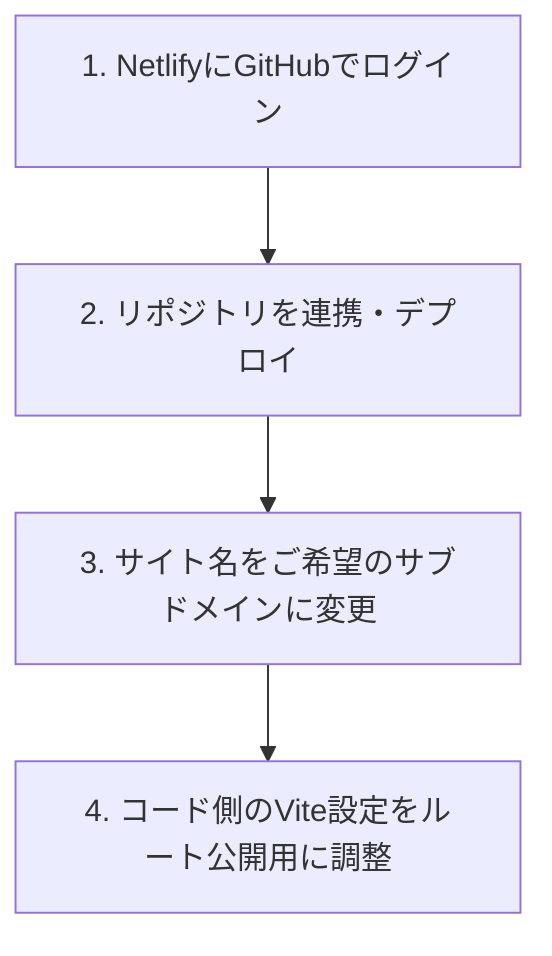

# GitHub Pages から Netlify へ移行して「https://[ご希望の名前].netlify.app」で公開する手順

Netlify（ネットリファイ）を使用すると、Vite でビルドしたサイトを非常に簡単に公開でき、URL も `/kami2web/` のようなサブフォルダのないすっきりとしたルートURL（例：`https://kamitakada.netlify.app/`）で公開できるようになります。

---

## 📋 全体フロー

---

## 🛠 詳細手順

### ステップ 1: Netlify にログインする
1. [Netlify 公式サイト](https://www.netlify.com/) にアクセスします。
2. 右上の **「Log in」** をクリックし、**「Sign up with GitHub」** または **「GitHub」ボタン** を選択して、ご自身の GitHub アカウントでログイン・連携します。

### ステップ 2: 新しいサイトとしてリポジトリをインポートする
1. ダッシュボード画面にある **「Add new site」**（新しいサイトを追加）をクリックし、**「Import an existing project」**（既存のプロジェクトをインポート）を選択します。
2. Git プロバイダーの選択画面で **「GitHub」** をクリックします。
3. リポジトリの一覧から、作成した Organization 内にある **`kamitakada/kami2web`** を選択します。
   > [!NOTE]
   > もし一覧にリポジトリが表示されない場合は、画面下の「Configure Netlify on GitHub」のリンクをクリックし、Netlify に `kamitakada` オーガニゼーション（または `kami2web` リポジトリ）へのアクセス権限を許可してください。
4. **Build settings**（ビルド設定）の画面が表示されます。Netlify が自動的に Vite の設定を検出するため、通常は以下の内容がすでに入力されています。
   * **Build command**: `npm run build`
   * **Publish directory**: `dist`
5. 設定を確認し、一番下にある **「Deploy kami2web」** ボタンをクリックします。これだけで最初の自動ビルドとデプロイが開始されます。

### ステップ 3: サイトのURLを変更する（例: kamitakada.netlify.app）
初期状態では、Netlify がランダムな英語の名前（例: `wonderful-water-12345.netlify.app`）を割り当てます。これをご希望の名称に変更します。
1. デプロイ完了後、サイトのダッシュボードで **「Site configuration」** （サイト設定）ボタンをクリックします。
2. **Site details** の項目にある **「Change site name」** （サイト名を変更）ボタンをクリックします。
3. **Site name** に、ご希望のサブドメイン名（例: **`kamitakada`** など）を入力し、保存します。
   * これにより、URLが **`https://[設定した名前].netlify.app`** に更新されます。

---

### ステップ 4: コード側の設定（Vite のパス設定）をルート用に最適化する
Netlify では `/kami2web/` というサブフォルダがなくなり、ルートドメイン直下（`/`）でサイトが公開されます。
そのため、Vite の設定を現在の「相対パス（`./`）」から「ルート絶対パス（`/`）」に最適化します。

このコードの修正（`vite.config.js` の変更）は、Netlify の登録とデプロイ完了後に私が自動で行いますので、手順2〜3が完了しましたら「Netlify の連携と設定が完了しました」とお知らせください！
